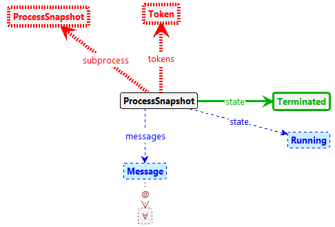

# ICGT-2023

This repository contains the sources for [the paper](./paper.pdf) submitted
to [ICGT-2023](https://conf.researchr.org/home/icgt-2023) together with additional information
below.

**The corresponding tool is
available [here](https://bpmnanalyzer.whitefield-c9fed487.northeurope.azurecontainerapps.io).**

## BPMN Semantics formalization

Our [wiki](https://github.com/timKraeuter/Rewrite_Rule_Generation/wiki) describes the the BPMN formalization in more detail accompanied by many example BPMN models and graph transformation rule examples.

### Process termination

Process termination is implemented by the following graph transformation rule in Groove:

The rule is called **Terminate** and is automatically added during graph grammar generation.
The dashed red borders mark parts of negative application conditions, grey parts remain untouched,
blue parts are
deleted and green parts are added.

## Model Checking BPMN

### BPMN-specific properties

BPMN-specific properties can be checked in the [web-based tool](https://bpmnanalyzer.whitefield-c9fed487.northeurope.azurecontainerapps.io), which runs Groove in the cloud (no local installation needed).

The following screenshot shows example verification results of the tool:

// TODO: Add screenshot here.

#### Safeness

The atomic property **Unsafe** is implemented by the following graph condition in Groove:

The property matches whenever two tokens of one process snapshot have the same position (but have
different identities).

#### Option to complete

The atomic property **AllTerminated** is implemented by the following graph condition in Groove:

The property matches whenever there is no process snapshot in the state running. All process
snapshots are terminated, i.e., have no tokens.

### Custom properties

Defining atomic propositions directly in the tool by distributing tokens over the process model has
not been implemented yet.
Thus, for the time being, custom properties have to be checked in Groove by defining atomic propositions there.

## Implementation

### Tool

The tool is available
online [here](https://bpmnanalyzer.whitefield-c9fed487.northeurope.azurecontainerapps.io).

The sourcecode of the tool is
available [here](https://github.com/timKraeuter/Rewrite_Rule_Generation) and instructions
how to run it locally on your machine can be
found [here](https://github.com/timKraeuter/Rewrite_Rule_Generation/blob/master/server/README.md).

### Test suite

The [wiki](https://github.com/timKraeuter/Rewrite_Rule_Generation/wiki) describes our [comprehensive test suite](https://github.com/timKraeuter/Rewrite_Rule_Generation/wiki/Test-Suite) to test our coverage of BPMN features. 

Feel free to contact me for further information.
